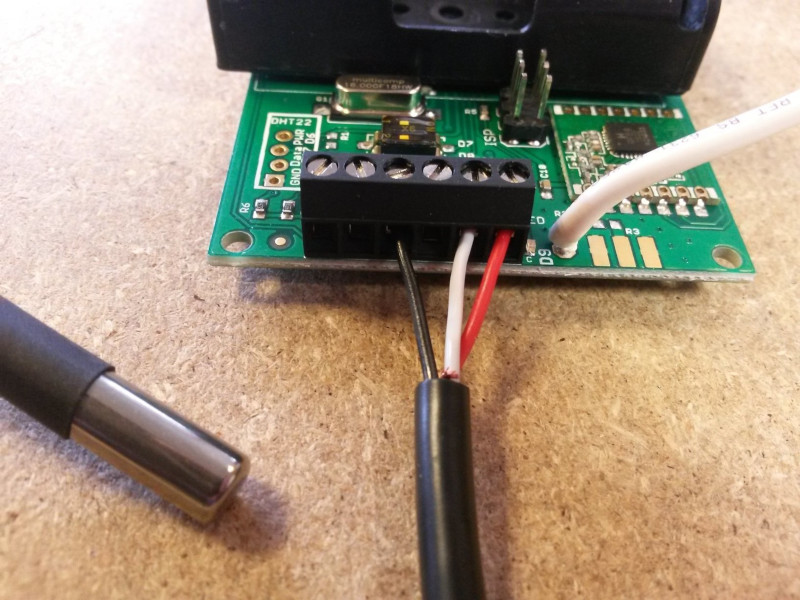
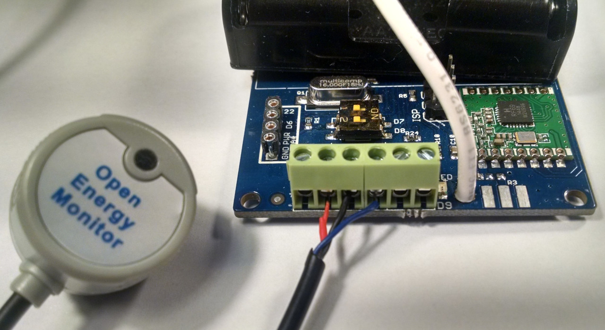
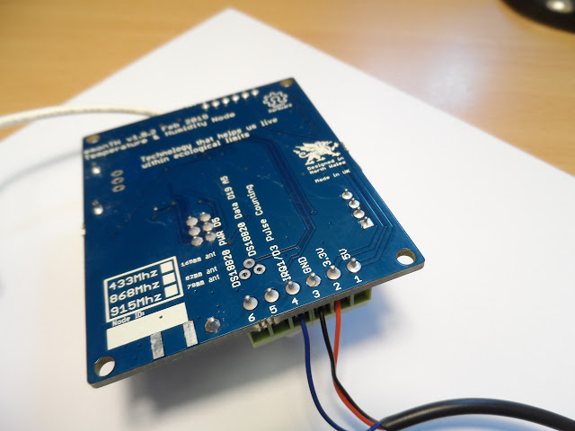

<a class="btn" href="https://shop.openenergymonitor.com/emonth-temperature-humidity-node/">Buy in Shop</a>

# EmonTH v2 Install

Data from the emonTH is transmitted via wireless RF (433MHz) to an emonPi / emonBase web-connected base-station for logging to Emoncms for data logging, processing and graphing.

With the 2x AA batteries installed and the emonTH powered up. **The emonTH is designed to appear automatically in the emoncms input list on the emonPi/base**. For systems with only one emonTH no further hardware setup is required.

If more than one emonTH is to be used with the same base-station, each emonTH will need a different RF node ID.


## Standard setup

### 1. Power Up

- Power emonTH from 2 x AA batteries
- Alternatively 5V DC can be wired into terminal block if required

### 2. Indicator LED

- Illuminates solid (dimly) for a few seconds at first power up
- LED should then extinguish to indicate successful sensor detection
- Flashing LED indicates sensor detection failure
- To preserve battery LED does NOT flash regularly during operation

### 3. Emoncms Setup

  - RF transmission from the emonTH will be picked up automatically and data will appear in local Emoncms Inputs page.
  - If [Remote logging](../emoncms/intro-remote.md) has been setup, data will also be posted to Emoncms.org.
  - See guide [Log Locally](../emoncms/intro-rpi.md) for an overview of logging inputs to feeds. For EmonTH inputs select a feed interval 60s or greater:
  
```{note}
Important: the emonTH reports data at a 60s interval, it's important to log the data to emoncms with a 60s inerval as shown below.
```


```{note}
If using more than 4x emonTH units (with custom RF node ID or modified firmware) [emonhub.conf node decoders will need to be setup](https://github.com/openenergymonitor/emonhub/blob/emon-pi/configuration.md).
```

---

## Changing the emonTH node ID

**DIP Switch Config**<br>
The on-board DIP switch can be used to select up to four node IDs:

| DIP 1 | DIP 2 | RF node ID V1.x firmware | RF node ID V2.x firmware |
|-------|-------|--------------------------|--------------------------|
| OFF   | OFF   | 19 (default)             | 23 (default)             |
| ON    | OFF   | 20                       | 24                       |
| OFF   | ON    | 21                       | 25                       |
| ON    | ON    | 22                       | 26                       |

**Serial Config**<br>
The emonTH node ID can also be changed using a USB to UART cable and the Arduino IDE.

## Add: External temperature sensor/s

The standard emonTH2 firmware supports connecting one external DS18B20 temperature sensor. 

- Black: GND
- Red: Power (digital I/O 5 is used as the power pin to enable sensor power-down between readings to save power)
- White: ADC5 (Dig 18) one-wire bus 



Alternative firmware is available that supports multiple external temperature sensors which can be useful for applications such as measuring the flow and return temperatures on a heat pump or radiator balancing, see [https://github.com/openenergymonitor/emonth2/tree/multiple_ds18b20_external](https://github.com/openenergymonitor/emonth2/tree/multiple_ds18b20_external).

## Add: External optical pulse sensor

The EmonTH has a digital input (with interrupt) that can be used for pulse counting. This can be used for wired pulse counting or with the Optical LED pulse sensor.

To use the Optical LED Pulse sensor the easiest way is to remove the RJ45 connector and then strip back the black sheathing to reveal the red (3.3V power), black (GND) and blue (pulse) wires.

Connect the red wire to the 3.3V terminal, the black wire to the GND terminal and the blue wire to the terminal labelled D3 (top) or IRQ1/D3 Pulse Counting (bottom of the board).

- Red: 3.3V
- Black: GND
- Blue: IRQ1/D3





**Input pull-up**<br>
There is an input pull-up inside the pulse (IRQ) input that is enabled in the standard sketch. Therefore, you can connect a volt-free contact or an SO output between screw terminal 4 (IRQ input, SO+) and screw terminal 3 (GND, SO-) without the need for an additional resistor. If you must connect your contacts between VCC (screw terminal 2) and screw terminal 4, then you must add a pull-down resistor of resistance low enough to overcome the internal pull-up resistor, or you can use a higher-value resistor and modify the sketch to disable the internal pull-up.

If you are using a reed switch, you may find that you get more than one count per pulse. Adding a 0.1 µF capacitor across the reed switch has been shown to eliminate this problem. 

**Emoncms input processing**<br>
To record the total accumulated pulse count in emoncms use the wh_accumulator input process which detects resets continuing the total pulse count accumulation from the last value before the reset.

