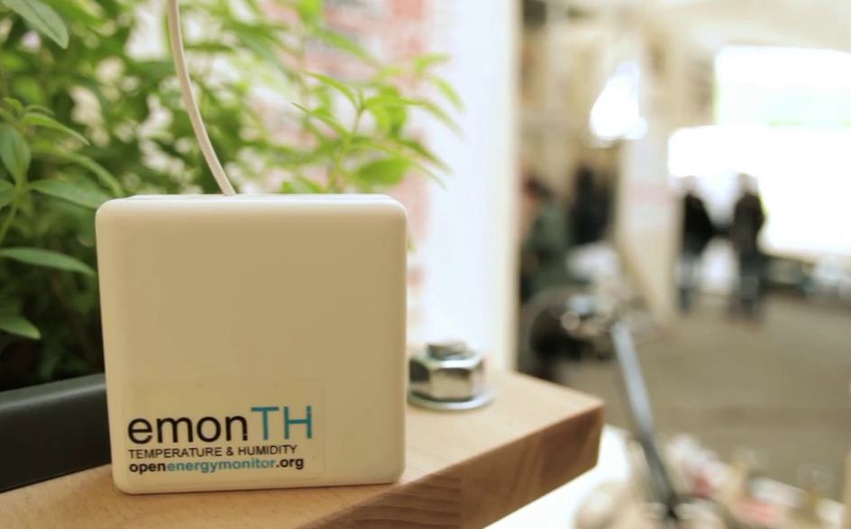

<a class="btn" href="https://shop.openenergymonitor.com/emonth-temperature-humidity-node/">Buy in Shop</a>

# Overview

The emonTH V2 is an open-source, wireless, battery-powered temperature and humidity monitoring node.

Data from the emonTH is transmitted via wireless RF (433MHz) to an emonPi / emonBase web-connected base-station for logging to Emoncms for data logging, processing and graphing.

The emonTH V2 features a [Silicon Labs Si7021](https://www.silabs.com/Support%20Documents%2FTechnicalDocs%2FSi7021-A20.pdf) temperature and humidity sensor instead of the DHT22 sensor. The Si7021 is more accurate and significantly (2000 times!) lower power then the DHT22. This increases the emonTH battery life; from 10 months to several years. The Si7021 is also much smaller than the DHT22.

The Si7021 sensor can be seen in the top right-hand corner of the PCB. The white film on top of the sensor is a dust film and should not be removed. The dust film is factory fitted and will protect the sensor from dust and air contaminants.

As with all our hardware units the emonTH V2 is fully open-source and manufactured locally in North Wales, UK using non-conflict materials lead-free processes.

**emonTH V2 Features**

- Wireless temperature & humidity monitoring node
- Communicates with emonPi & emonBase via RF (433Mhz)
- 1yr+ battery life (2 x AA not included)
- Up to 4x emonTH can communicate to a single emonPi*
- Internal temperature & humidity + optional external probe
- Optional pulse sensor input

\* *More than 4x emonTH units can be connected to a single emonPi / emonBase with manual change of RF nodeID. This can be done via [serial node ID config](https://community.openenergymonitor.org/t/emontx-emonth-configure-rf-settings-via-serial-released-fw-v2-6-v3-2/2064?u=glyn.hudson)*

- Microcontroller: Arduino compatible ATmega328p
- Internal Sensor: Si7021 (internal temperature & Humidity)
- External Sensor (OPTIONAL): DS18B20 external temperature sensor. See hardware wiki for connections
- Power: 2 x AA from onboard holder, LTC3525 3.3V DC-DC boost converter to extend battery life
- RF Radio: RFM69CW 433Mhz

**Si7021 Temperature & Humidity Sensor**

- Silicon Labs SI7021-A20-GM1R
- Power supply 1.9V - 3.6V
- Operating range humidity 0-80%RH; temperature -40~125 deg C
- Accuracy humidity +-3%RH
- Accuracy Temperature: +-0.4 degC
- Active current: 150uA
- Sleep current 0.06uA
- Measurement time: 2.6ms = 10ms

[See DHT22 VS Si7021 technical comparison table](https://github.com/openenergymonitor/emonth2/tree/master/sensor)
