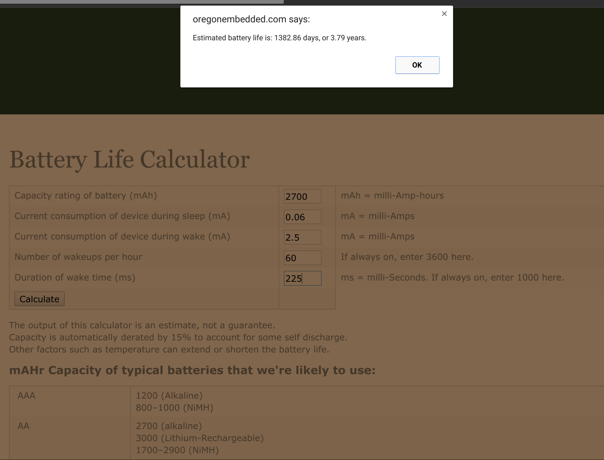
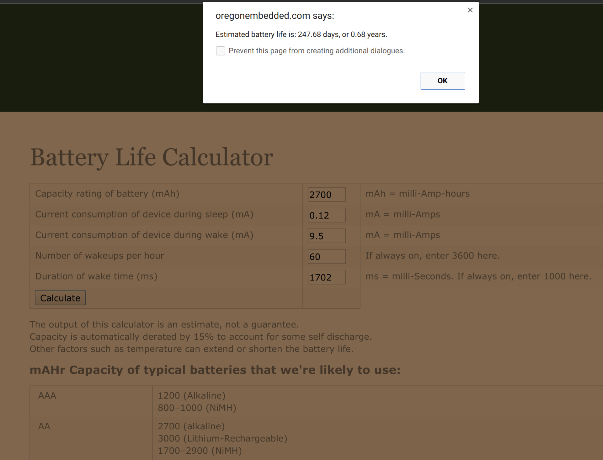

# Power Consumption

The motivation behind replacing the DHT22 Temperature & Humidity sensor used on the emonTH V1 with the Si7021 Temperature & Humidity sensor on the emonTH V2 was the power saving benefits.

See the `sensor` folder in the emonth2 repo for a power consumption comparision between the DHT22 and Si7021.

This document contains real-world emonTH2 power consumption as measured using a multi-meter & scope resistor voltage drop method [explained in previous blog post](http://blog.openenergymonitor.org/2013/07/new-oscilloscope/).

Here is a scope trace illustrating the emonTH power consumption during a sensor sample:

1. Atmega328 wakes up, starts sensors and takes readings: 17.5ms @ 8.4mA

2. Atmega328 goes back to watchdog sleep but leaves SPI initialised waiting for wait for RFM to initialise: 100ms @ 2mA - \*now reduced ([see code](https://github.com/openenergymonitor/emonth2/blob/master/firmware/src/src.ino#L331))

3. RFM69CW transmission: 4ms @ 44mA

4. Wait for RF transmission to finish: 100ms @ 0.06mA

5. ATmega328 wakes up to Print data to serial UART: 5ms @ 7.2mA

Time taken for sample = 17.5 + 100 + 4 + 100 + 5 = **226.5ms**

Average current per sample = (17.5*8.4) + (100*2) + (4*44) + (100*0.06) + (5*7.2) / 225.5 =  565 / 225.5 = 2.5mA

After sensor sample is complete the ATmega328 goes back to full watchdog sleep for consuming 0.06mA. This base quiescent consumption includes the quiescent power consumption of the LTC3525 DC-DC converter. See original emonTH hardware blog post for [emonTH DC-DC converter design](https://blog.openenergymonitor.org/2013/10/emonth-update-hardware/).

Assuming one reading per min (current default) the emonTH is off (sleeping for): number of ms in one min - on time = 60000ms - 225.5ms = 59774.5

***

To summarise:

- On current  = 2.5mA (average)
- On time     = 226ms
- Off current = 0.06mA
- Off time    = 59774.5 ms

[Oregon Embedded online battery life calculator tool](http://oregonembedded.com/batterycalc.htm) can now be used to calculate battery live. Assuming using 2 x AA alkaline batteries @ 2700 mAhr each = 5400\*

\* *The 2 x AA batteries are connected in series but since uses emonTH uses a DC-DC converter capacity is effectivly 2xAA capacity (mius losses), [see forum post](https://community.openenergymonitor.org/t/emonth-v2/1696/18?u=glyn.hudson)*

Given the measured power consumption the emonTh2 is estimated to have a battery life of 7.6 years!

Plugging in the [power consumption figures from the emonTh V1](http://blog.openenergymonitor.org/2013/10/emonth-update-software-power/) (with DHT22) into the calculator a 1.4 year battery life is estimated.

From [real world testing](http://blog.openenergymonitor.org/2015/02/real-world-emonth-battery-life) is been established that the emonTh V1 actually achieves a 8 month battery life. This is 57% less than the estimated figure.

Assuming the battery life calculator is overestimating by the same amount for the emonTH V2 we can **expect a real world battery life of just over 5 years**, which is not too bad :-p

I have setup a battery life test with the emonTh V2 with Si7021 sensor, I will report back in a couple of years :-)

***

See [forum topic discussion](https://community.openenergymonitor.org/t/emonth-v2/1696/18)
