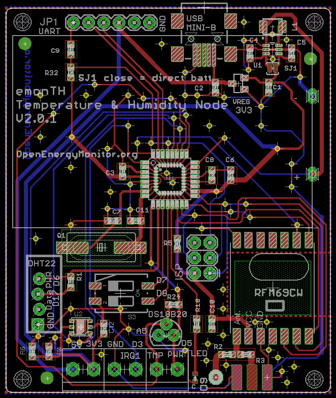
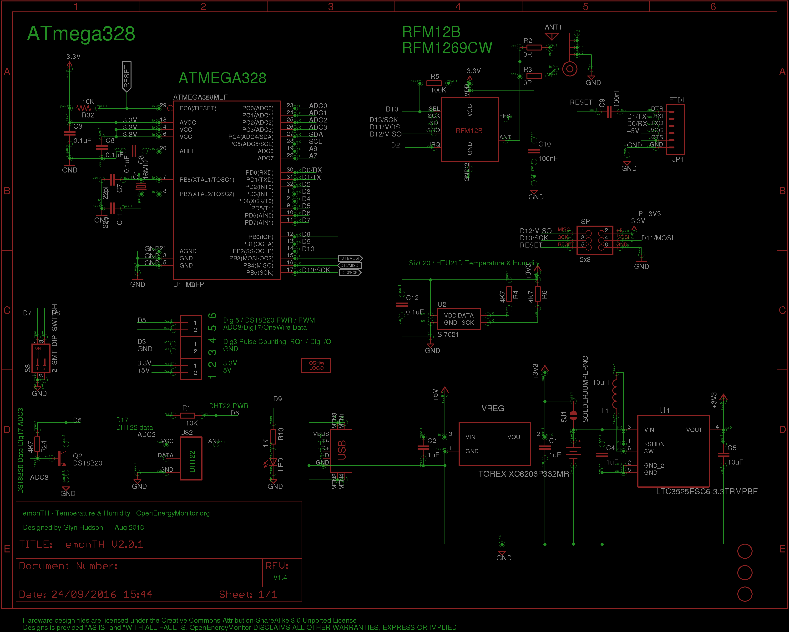

# Board

# Schematic

# Change log

## V2.0.2 (26th Sep 2016)

- Fix LED trace

## V2.0.1 (Aug 2016)

- Add SI7021 temperature & humidity sensor (see `si7021_eval` folder in emonth2 repo)
- Re-jig port map from emonTH V1.5 to make available I2C pins for SI7021

# Port Map

|                |           |            |                       |
|----------------|-----------|------------|-----------------------|
| Arduino        | ATmega328 | Function   | emonTH V2             |
| Analog 0 (D14) | PC0       |            |                       |
| Analog 1 (D15) | PC1       |            | 2x AA Battery Voltage |
| Analog 2 (D16) | PC2       |            | DHT22 Data            |
| Analog 3 (D17) | PC3       |            | DS18B20 One-wire Data |
| Analog 4 (D18) | PC4       | (SDA)      | SI7021 SDA (Data)     |
| Analog 5 (D19) | PC5       | (SCL)      | SI7021 SCL (SCK)      |
| Analog 6 (D20) |           |            |                       |
| Analog 7 (D21) |           |            |                       |
| Digital 0      | PD0       | (RXD)      | FTDI Tx               |
| Digital 1      | PD1       | (TXD)      | FTDI Rx               |
| Digital 2      | PD2       | (int0) PWM | RFM69CW IRQ           |
| Digital 3      | PD3       | (int1) PWM | Terminal block        |
| Digital 4      | PD4       |            |                       |
| Digital 5      | PD5       | PWM        | DS18B20 PWR           |
| Digital 6      | PD6       | PWM        | DHT22 PWR             |
| Digital 7      | PD7       |            | DIP 1                 |
| Digital 8      | PB0       |            | DIP 2                 |
| Digital 9      | PB1       | PWM        | LED                   |
| Digital 10     | PB2       | (SS) PWM   | RFM69CW SEL           |
| Digital 11     | PB3       | (MOSI) PWM | RFM69CW SDI           |
| Digital 12     | PB4       | (MISO)     | RFM69CW SDO           |
| Digital 13     | PB5       | (SCK)      | RFM69CW SCK           |

# BOM

|Qty |Value                |Device               |Package         |Parts          |Description                                                            |
|----|---------------------|---------------------|----------------|---------------|-----------------------------------------------------------------------|
|1   |                     |ANTENNA              |PAD-01          |ANT1           |Antenna                                                                |
|1   |                     |LEDCHIPLED-0603-TTW  |CHIPLED-0603-TTW|LED            |LED                                                                    |
|4   |0.1uF                |C-EUC0603            |C0603           |C3, C6, C8, C12|CAPACITOR, European symbol                                             |
|2   |0R                   |R-EU_R0603           |R0603           |R2, R3         |RESISTOR, European symbol                                              |
|1   |100K                 |R-EU_R0603           |R0603           |R5             |RESISTOR, European symbol                                              |
|2   |100nF                |C-EUC0603            |C0603           |C9, C10        |CAPACITOR, European symbol                                             |
|1   |10K                  |R-EU_R0603           |R0603           |R1             |RESISTOR, European symbol                                              |
|1   |10K                  |R-US_R0603           |R0603           |R32            |RESISTOR, American symbol                                              |
|1   |10uF                 |C-EUC0603            |C0603           |C5             |CAPACITOR, European symbol                                             |
|1   |10uH                 |INDUCTOR1210         |1210            |L1             |Inductors                                                              |
|1   |16Mhz                |CRYSTALHC49UP        |HC49UP          |Q1             |CRYSTAL                                                                |
|1   |1K                   |R-EU_R0603           |R0603           |R10            |RESISTOR, European symbol                                              |
|3   |1X2-3.5MM            |1X2-3.5MM            |1X2-3.5MM       |J1, J2, J3     |3.5mm Terminal block                                                   |
|3   |1uF                  |C-EUC0603            |C0603           |C1, C2, C4     |CAPACITOR, European symbol                                             |
|2   |22pF                 |C-EUC0603            |C0603           |C7, C11        |CAPACITOR, European symbol                                             |
|1   |2_SMT_DIP_SWITCH     |2_SMT_DIP_SWITCH     |DIP_SWITCH_SMT  |S3             |Multicomp MCEMR-02-T                                                   |
|1   |2x3                  |AVR_SPI_PRG_6PTH     |2X3             |ISP            |AVR ISP 6 Pin                                                          |
|1   |3V                   |3X_AAA_BATTERY_HOLDER|AAA_PCB_HOLDER  |U$3            |2x AA Battery Holder                                                   |
|3   |4K7                  |R-EU_R0603           |R0603           |R4, R6, R24    |RESISTOR, European symbol                                              |
|1   |ATMEGA168MLF         |ATMEGA168MLF         |MLF32           |U1_MLF         |Atmel 32-pin 8-bit micro, 16k flash.                                   |
|1   |ATMEGA328P           |ATMEGA328_SMT        |TQFP32-08       |U1_TQFP        |32-Pin Atmega328 part                                                  |
|1   |DS18B20              |TRANSISTOR_NPNTO92   |TO-92           |Q2             |Transistor NPN                                                         |
|3   |FIDUCIAL             |FIDUCIAL             |FIDUCIAL_1MM    |U$1, U$6, U$7  |For use by pick and place machines to calibrate the vision/machine, 1mm|
|1   |FTDI                 |FTDI_BASICPTH        |FTDI_BASIC      |JP1            |FTDI Basic: 3.3V and 5V                                                |
|1   |LTC3525ESC6-3.3TRMPBF|LTC3525ESC6-3.3TRMPBF|SOT65P210X100-6N|U1             |Step-Up DC/DC Converter                                                |
|1   |RF-LINK_TX           |RF-LINK_TX           |RF-LINK_TX      |U$2            |                                                                       |
|1   |RFM12B               |RFM12B               |RFM12B          |RFM69CW        |                                                                       |
|1   |SI7021               |SI7021               |SI7021          |U2             |The Si7021 is an I2C Humidity and Temperature Sensor                   |
|1   |SMA_EDGE             |SMA_EDGE             |SMA-EDGE        |J$1            |SMA Antenna Connector                                                  |
|1   |SOLDERJUMPERNO       |SOLDERJUMPERNO       |SJ_2S-NO        |SJ1            |Solder Jumper                                                          |
|1   |TOREX XC6206P332MR   |MCP1700T-3302E/TT    |SOT95P237X112-3N|VREG           |Low Quiescent Current LDO                                              |
|1   |USB-MINIB-5PIN       |USB-MINIB-5PIN       |USB-MINIB-CISECO|U$5            |Mini-USB "B" connector with 5th pin broken out.                        |
