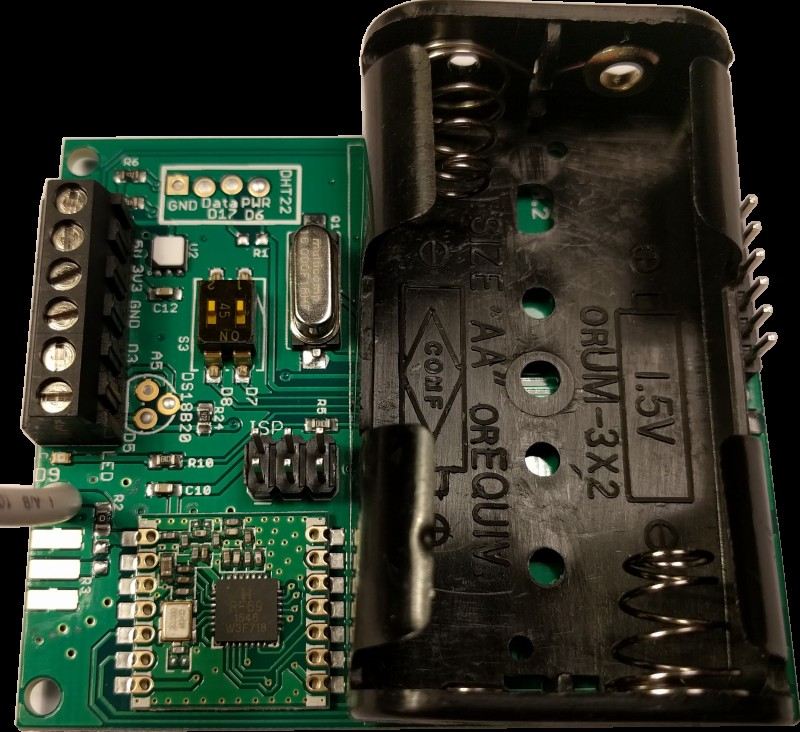

# emonTH V2.0

[](https://travis-ci.org/openenergymonitor/emonth2)

**Low power wireless temperature and humidity node**

*V2.0 hardware revision adds support for SI7021 temperature and humidity. This sensor brings performance and power savings over the DHT22, see [sensor](sensor) folder of this repo for sensor evaluation and comparison.*

The emonTH V2 is an open-source, wireless, battery powered temperature and humidity monitoring node.

Data from the emonTH is transmitted via wireless RF (433MHz) to an emonPi / emonBase web-connected base-station for logging to Emoncms for data logging, processing and graphing.





### Open-Hardware 

- Hardware schematic & CAD files are in the `hardware` folder of this repo
- See [emonTH V1 Technical Wiki](https://wiki.openenergymonitor.org/index.php/EmonTH_V1.5) for more hardware design notes.


### Related Blog Posts


- [Introducing emonTH V2](http://blog.openenergymonitor.org/2016/09/emonth2/)

- [Optical Pulse Counting with emonTH](https://blog.openenergymonitor.org/2015/09/optical-pulse-counting-with-emonth/)
- [emonTH V1 Prototype](https://blog.openenergymonitor.org/2013/06/emonth-prototype/)
- [emonTH V1 Hardware Design](https://blog.openenergymonitor.org/2013/10/emonth-update-hardware/)
- [emonTH V1 Software & Power Optimise](https://blog.openenergymonitor.org/2013/10/emonth-update-software-power/)
- [emonTH Battery Choice Considerations](https://blog.openenergymonitor.org/2013/10/aa-battery-considerations/)

### Related Forum Posts

- [HTU21D Temperature and Humidity sensor, possible DHT22 replacement?](https://community.openenergymonitor.org/t/htu21d-temperature-and-humidity-sensor-possible-dht22-replacement/1106/21)


# Firmware

## Pre-compiled 

Either upload pre-compiled firmware (from github releases) using our [emonUpload tool](https://github.com/openenergymonitor/emonupload) or compile and upload

## Compile & Upload

PlatformIO is recommended as the easiest way to compile and upload Arduino compatible firmware for emonTH. One of the big advantages of using PlatformIO is all libraries can be automatically downloaded. Arduino IDE can also be used but libraries must be manually installed.

## Compile & Upload Firmware Using PlatformIO

For a full guide and installing and using PlatformIO (including visual IDE) see ['Compiling' User Guide Section](https://guide.openenergymonitor.org/technical/compiling). Assuming platformIO is installed

```
$ git clone https://github.com/openenergymonitor/emonth2
$ cd emonth2
$ pio run
$ pio -t upload
```

# Hardware

emonTH hardware is fully open-source. See `hardware` folder of this repo for Gerbers, Eagle CAD design, BOM & port map.
