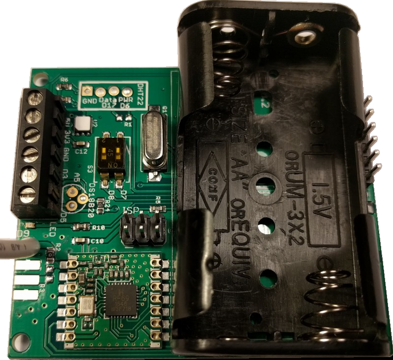

# emonTH V2.0

**Low power wireless temperature and humidity node**

*V2.0 hardware revision adds support for SI7021 temperature and humidity. This sensor brings performance and power savings over the DHT22, see [sensor](sensor) folder of this repo for sensor evaluation and comparison.*

The emonTH V2 is an open-source, wireless, battery powered temperature and humidity monitoring node.

Data from the emonTH is transmitted via wireless RF (433MHz) to an emonPi / emonBase web-connected base-station for logging to Emoncms for data logging, processing and graphing.

## Documentation

- [Overview](https://docs.openenergymonitor.org/emonth2/overview.html)
- [Installation](https://docs.openenergymonitor.org/emonth2/install.html)
- [Firmware](https://docs.openenergymonitor.org/emonth2/firmware.html)
- [Configuration](https://docs.openenergymonitor.org/emonth2/configuration.html)
- [Technical](https://docs.openenergymonitor.org/emonth2/technical.html)
